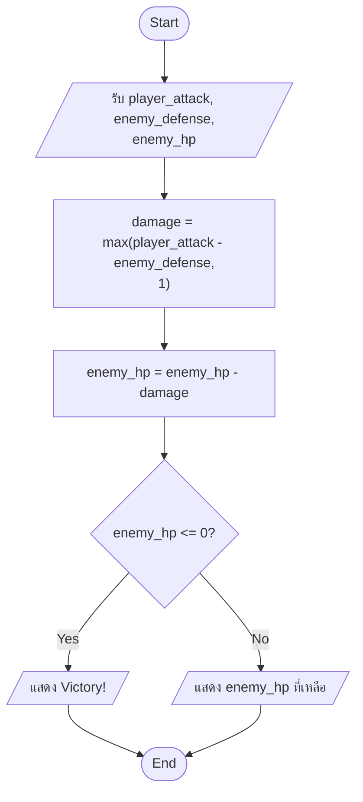
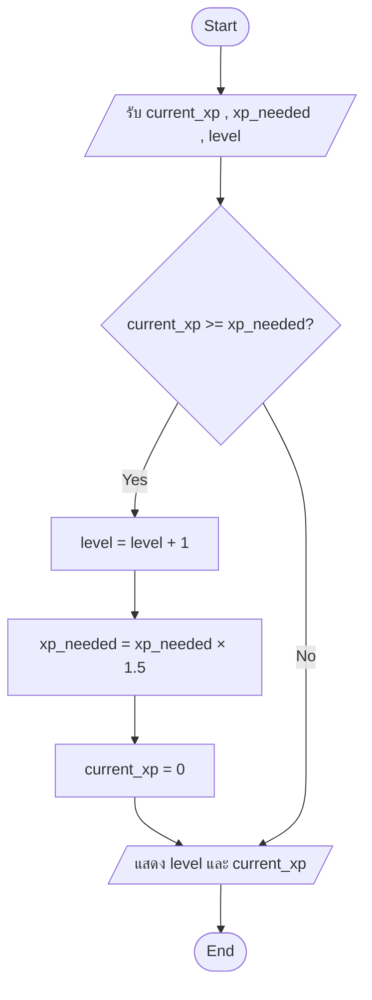

```mermaid
flowchart TD
Start([Start]) --> Input[/รับ player_attack, enemy_defense,
enemy_hp/]
Input --> Calc["damage = max(player_attack - enemy_defense,
1)"]
Calc --> Reduce["enemy_hp = enemy_hp - damage"]
Reduce --> D1{enemy_hp <= 0?}
D1 -->|Yes| Win[/แสดง Victory!/]
D1 -->|No| Show[/แสดง enemy_hp ที่เหลือ/]
Win & Show --> End([End])
```

```mermaid
flowchart TD
Start([Start]) --> Input[/รับ current_xp , xp_needed , level/]
Input --> D1{current_xp >= xp_needed?}
D1 --> |Yes| p1["level = level + 1"]
p1 --> p2["xp_needed = xp_needed × 1.5"]
p2 --> p3["current_xp = 0"]
p3 --> O
D1 --> |No| O[/แสดง level และ current_xp/]

O --> End([End])
```
